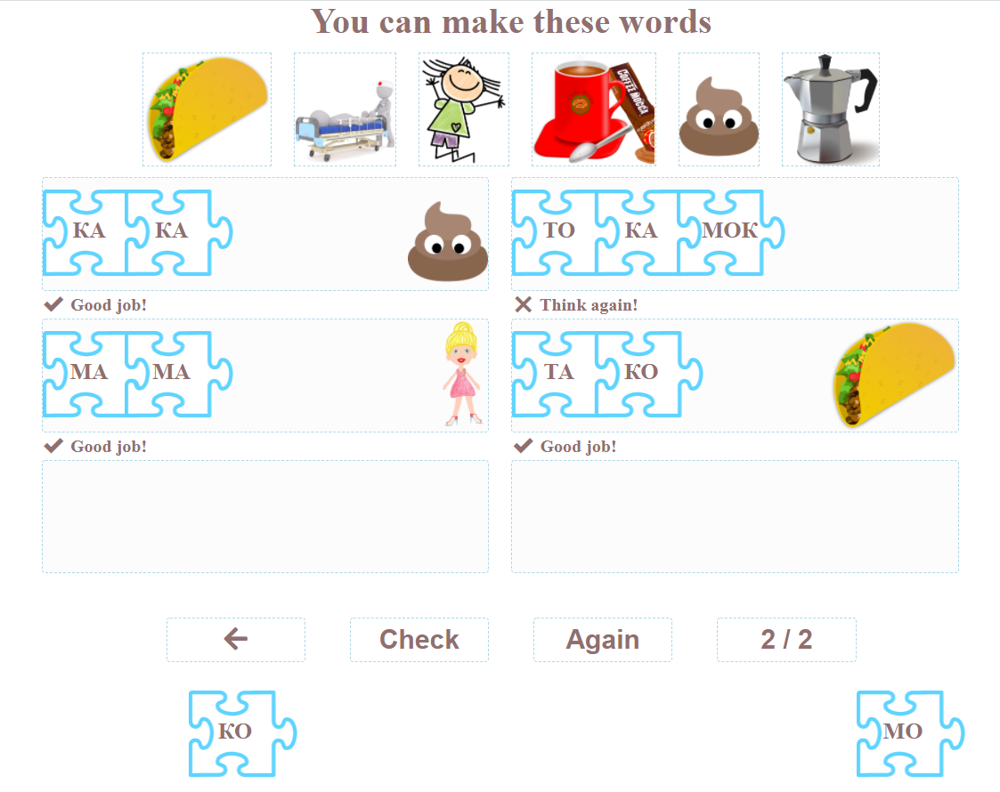

# rsschool.cv
# [Rolling Scopes School](https://app.rs.school)
- - -
# Oksana Iukhymchuk
- - -
### **Contacts**

| **location** | *Kyiv, Ukraine* |
| ---------- | --------|
| **email** | *iukhymchuk.oksana@gmail.com* |
| **telegram** | *@oksanaiu* |


- - - 
### **Information**
My goal is to learn frontend and have the skills to create fun interactive sites, especially for educational purposes. I am passionate about growing professionally and learning from the people who already program in JavaScript. This is the reason I became the part of RS School JS Course. 
- - -
### **Skills** 
I started learning to code a year and a half ago when we all stayed home for quarantine. I have some basic knowledge in html, css, and js. I started to apply my knowledge creating the site: [IlearnRussian.net](https://www.ilearnrussian.net). It has examples of the code I wrote on my own, the code I adapted from workshops I took, the code modified by a mentor, and the free code I found on the internet and changed a little. These are my first efforts so do not judge me harshly.  
- - -
### **Work Experience**
I have not worked as programmer yet, except the site I have been creating: [ilearnRussian](https:www.ilearnrussian.net). I have been teaching Russian for foreigners and history of Ukraine for foreigners. 
- - -
### **English Level** 
C1, I majored in translating and teaching English. I have over 20 years of experience in communicating with native speakers and teaching in English.
- - -
### **Education** 
I have taken several courses on Udemy, watched and practiced a lot of workshops on youtube. My favorite teachers are:
* John Smilga (htmls&css) and 
* Dmitri Trepachov (Дмитрий Трепачёв, js). 


#### I took the following courses:
* [x] Udemy HTML&CSS Course - John Smilga;
* [x] Udemy Javascript Course - Jonas Schmedtmann;
* [x] HTML, CSS, JS Tutorials on the [w3schools](https://www.w3schools.com);
* [ ] [Dmitri Trepachov JS course](http://code.mu/ru/javascript/book/prime/) (in progress);
* [ ] [RS School Course "JS/FE. Stage 0"](https://app.rs.school/) (in progress);
* [ ] [Ilya Kantor JavaScript Book](https://learn.javascript.ru/) (in progress);

- - -
### **Code Example**
*I have written the code for this game fully by myself. A player needs to combine syllables to make words seen in the pictures. If the word is correct, they can see a picture next to it and a checkmark. But if the word is incorrect, it is marked wrong. They can keep working and checking their work until they make all the words.*
#### **It can be played here: [Match Syllables Game](https://ilearnrussian.net/alphabet/drag-drop/drag-drop-syllables_al1.html)**

#### Part 1
```
let wordBankEasy = [    
    ['ко-ко-ко́', 'cluck-cluck', ``, '../alphabet_images/alphabet1/chicken_apng.png'],
    ['ма́ма', 'mom', '', '../alphabet_images/alphabet1/mom_apng.png'],
    ['кот', 'cat', ``, '../alphabet_images/alphabet1/cat_apng.png'],
    ['а́том', 'atom', ``, '../alphabet_images/alphabet1/atom_apng.png'],
    ['кака́о', 'hot chocolate', ``, '../alphabet_images/alphabet1/hot-chocolate.png'],
    ['мака́ка', 'macaque', ``, '../alphabet_images/alphabet1/macaque.png'],
    ['та́ко', 'taco', ``, '../alphabet_images/alphabet1/taco.png'],
    ['ко́ма', 'coma', ``, '../alphabet_images/alphabet1/coma.png'],
    ['мак', 'Mac', ``, '../alphabet_images/alphabet1/mac.png'],
    ['Том', 'Tom', ``, '../alphabet_images/alphabet1/tom.png'],
    ['То́ма', 'Toma', ``, '../alphabet_images/alphabet1/toma.png'],
    ['мо́кко', 'espresso w/ hot milk and chocolate', ``, '../alphabet_images/alphabet1/coffee-mocca.png'],
];

let wordBankHard = [
    ['мат', 'checkmate', ``, '../alphabet_images/alphabet1/checkmate.png'],        
    ['мат', 'mat', ``, '../alphabet_images/alphabet1/mat.png'],
    ['том', 'volume', ``, '../alphabet_images/alphabet1/volume-marx.png'],
    ['ток', 'electrical current', ``, '../alphabet_images/alphabet1/electrical-current_apng.png'],
    ['мак', 'poppy flower', ``, '../alphabet_images/alphabet1/poppies.png'],
    ['там', 'there', ``, '../alphabet_images/alphabet1/there.png'],
    ['кто', 'who', ``, '../alphabet_images/alphabet1/who.png'],
    ['ка́ка', 'poo', ``, '../alphabet_images/alphabet1/kaka.png'],
    ['мо́ка', 'geiser coffee maker', ``, '../alphabet_images/alphabet1/moka.png'],
];
    
let wordBankPhrases = [
    ['кака́о кота́м', 'hot chocolate to the cats', ``, '../alphabet_images/alphabet1/chocolate-to-cats_apng.png'],
    ['кот Том', 'cat Tom', ``, '../alphabet_images/alphabet1/catTom.png'],
    ['мак ма́мам', 'poppies to moms', ``, '../alphabet_images/alphabet1/poppies-to-moms.png'],
    ['та́ко мака́кам', 'taco for macaques', ``, '../alphabet_images/alphabet1/taco-to-macaques.png'],
    ['тот кот', 'that cat', ``, '../alphabet_images/alphabet1/that-cat.png'],
    ['тот мат', 'that mat', ``, '../alphabet_images/alphabet1/that-mat.png'],
    ['тот мак', 'that poppy', ``, '../alphabet_images/alphabet1/that-poppy.png'],
    ['та ма́ма', 'that mom', ``, '../alphabet_images/alphabet1/that-mom.png'],
    ['та мака́ка', 'that macaque', ``, '../alphabet_images/alphabet1/that-macaque.png'],
    ['то кака́о', 'that cocoa', ``, '../alphabet_images/alphabet1/that-hot-chocolate.png'],
    ['то та́ко', 'that taco', ``, '../alphabet_images/alphabet1/that-taco.png'],
];
    

let wordBankSentences = [
    ['Кто там?', 'Who is there?', ``, '../alphabet_images/alphabet1/who-there.png'],
    ['Там кот Том.', 'There is cat Tom there.', ``, '../alphabet_images/alphabet1/cat-tom-there.png'],
    ['Там кака́о, а там та́ко.', 'There is hot chocolate there, and there\'s taco there.', ``, '../alphabet_images/alphabet1/hot-chocolate-taco-there.png'],
    ['Там ма́ма, а там То́ма.', 'There is mom, and there is Toma.', ``, '../alphabet_images/alphabet1/mom-toma-there.png'],
    [`Там кот, а там Том. А там кот Том.`, 'There is the cat, and there is Tom. And there is cat Tom.', ``, '../alphabet_images/alphabet1/cat-tom-cattom-there.png'],
    ['Там та мака́ка, а там - та.', 'There is that macaque there and there\'s that one. ', ``, '../alphabet_images/alphabet1/that-macaque-2.png'],
    ['То та́ко там, а то - там.', 'That taco is there and that one is there.', ``, '../alphabet_images/alphabet1/that-taco-2.png'],
    ['Тот кот там, а тот - там.', 'That cat is there and that one is there.', ``, '../alphabet_images/alphabet1/that-cat-2.png'],
    ['Тот мак там, а тот - там.', 'That poppy is there and that one is there.', ``, '../alphabet_images/alphabet1/that-poppy-2.png'],
];


let makeWordsSyllables = [
        ['ко-ко-ко́', 'cluck-cluck', ``, '../alphabet_images/alphabet1/chicken_apng.png'],
        ['ма́ма', 'mom', '', '../alphabet_images/alphabet1/mom_apng.png'],
        ['а́том', 'atom', ``, '../alphabet_images/alphabet1/atom_apng.png'],
        ['кака́о', 'hot chocolate', ``, '../alphabet_images/alphabet1/hot-chocolate.png'],
        ['мака́ка', 'macaque', ``, '../alphabet_images/alphabet1/macaque.png'],
        ['Том', 'Tom', ``, '../alphabet_images/alphabet1/tom.png'],
        ['та́ко', 'taco', ``, '../alphabet_images/alphabet1/taco.png'],
        ['ко́ма', 'coma', ``, '../alphabet_images/alphabet1/coma.png'],
        ['То́ма', 'Toma', ``, '../alphabet_images/alphabet1/toma.png'],
        ['мо́кко', 'espresso w/ hot milk and chocolate', ``, '../alphabet_images/alphabet1/coffee-mocca.png'],
        ['ка́ка', 'poo', ``, '../alphabet_images/alphabet1/kaka.png'],
        ['мо́ка', 'geiser coffee maker', ``, '../alphabet_images/alphabet1/moka.png'],
];


let letterSyllableBank = ['А', 'О', 'М', 'Т', 'К', 'ма', 'мо', 'ам', 'ом', 'ка', 'ко', 'ак', 'ок',  'та', 'то', 'ат', 'от' ]
let wordBankEasyHard = wordBankEasy.concat(wordBankHard);
let wordBankHardPhrases = wordBankHard.concat(wordBankPhrases);
let flashcardsBank = [
    ['тот', '"that" for nouns ending in a consonant', '', ''],
    ['та', '"that" for nouns ending in "A"', '', ''],
    ['то', '"that" for nouns ending in "O"', '', ''],
    ['а', 'but | and', '', ''],
    ['как', 'How?', '', ''],
    ['так', 'like this', '', ''],
]
flashcardsBank = flashcardsBank.concat(wordBankEasyHard);
```
#### Part 2
```
 <script>
        let syllables = [];
        let syllables1 = ['ко', 'ко', 'ко', 'ма', 'ма', 'а', 'том', 'ка', 'ка', 'о', 'ма', 'ка', 'ка', 'том'];
        let syllables2 = ['та', 'ко', 'ко', 'ма', 'то', 'ма', 'мок', 'ко', 'ка', 'ка', 'мо', 'ка'];  
        let pictures = [];
        for(let i = 0; i <makeWordsSyllables.length; i++) {
            pictures.push(makeWordsSyllables[i][2]);
        }

        let randomNumber = Math.ceil(Math.random() *2);
        document.querySelector('.set-number').innerHTML = `${randomNumber} / 2`;
        console.log(randomNumber)
        syllables = (randomNumber === 1) ? syllables1 : syllables2;
        syllables = syllables.sort(()=> Math.random() - 0.5);    


        let imagesDiv = document.querySelector('.images');
        imagesDiv.innerHTML = (randomNumber ===1) ? pictures.slice(0, 6).join('') : pictures.slice(6).join('');
    </script>
```
#### Part 3
```
let words = [];
        let images = [];

        let parentsContainer = document.querySelector('.parents-container');
        for(let i = 0; i<6; i++){
            let parentWrapper = document.createElement('div');
            parentWrapper.classList.add('parent-wrapper');
            parentsContainer.appendChild(parentWrapper);
            let parent = document.createElement('div');
            parent.classList.add('parent');
            let result = document.createElement('div');
            result.classList.add('result');
            parentWrapper.appendChild(parent);
            parentWrapper.appendChild(result);
        }


        let panel = document.getElementById('panel');
        for(let i = 0; i < syllables.length; i++){
            let elemWrapper = document.createElement('div');
            elemWrapper.classList.add('elem-wrapper');
            panel.appendChild(elemWrapper);
            let elemDiv = document.createElement('div');
            elemDiv.classList.add('elem');
            elemDiv.setAttribute('draggable', 'true');
            let elemDivText = document.createElement('div');
            elemDivText.classList.add('elem-text');
            elemDiv.appendChild(elemDivText);
            elemDivText.textContent = `${syllables[i]}`;
            elemWrapper.appendChild(elemDiv);
        };
    

        for(let i = 0; i <flashcardsBank.length; i++) {
            words.push(flashcardsBank[i][0].replace(/[-́]/g, '').toLowerCase());
            images.push(flashcardsBank[i][3]);
        }


       let elems = document.querySelectorAll('.elem');
       let parents = document.querySelectorAll('.parent');
       let results = document.querySelectorAll('.result');
       let score = 0;
        elems.forEach(function(elem) {
            elem.addEventListener('dragstart', function(event) {
                current = this;
            })
        });

        parents.forEach(function(parentElem) {
            parentElem.addEventListener('dragover', function(event) {
                event.preventDefault();
            })
        });

        parents.forEach(function(parentElem) {
            parentElem.addEventListener('drop', function(event) {
                this.appendChild(current);
        })
        });

        panel.addEventListener('dragover', function(event) {
            event.preventDefault();
        });

        panel.addEventListener('drop', function(event) {
            this.appendChild(current);
        });


        document.querySelector('.btn-check').addEventListener('click', checkResults);
        document.querySelector('.btn-again').addEventListener('click', init);

        function init() {
            window.location.reload();
        }
        function checkResults() {
            score = 0;
            parents.forEach(function(parent){
                let textContent = '';
                let elems = Array.from(parent.querySelectorAll('.elem'));
                elems.forEach(function(elem){
                    textContent += elem.textContent;
                })
                // score = 0;
                if(textContent ==='') return;
                else if(words.includes(textContent)) {
                    parent.parentElement .querySelector('.result').innerHTML = "✔️ Good job!";
                    // score = score + 1 - words[textContent]
                    console.log(words.indexOf(textContent));
                    console.log(textContent);
                    score++;
                    document.querySelector('.score-paragraph').innerHTML = `Your score is <span class="emphasize">${score}</span> words out of 6.`;
                    parent.style.backgroundImage = `url('${images[words.indexOf(textContent)]}')`;
                    parent.style.backgroundPosition = 'right';
                    parent.style.backgroundSize = 'contain';
                    parent.style.backgroundRepeat = 'no-repeat';
                }
                else if(!words.includes(textContent)) {
                    parent.parentElement.querySelector('.result').innerHTML = "❌ Think again!";
                    parent.style.backgroundImage = '';
                }
            });   
        };
```

